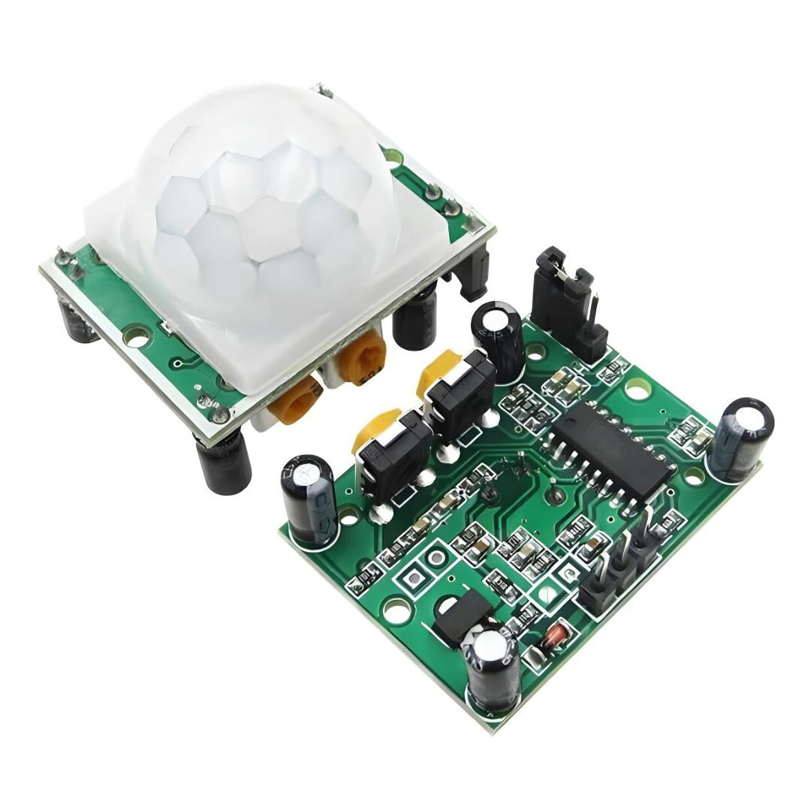
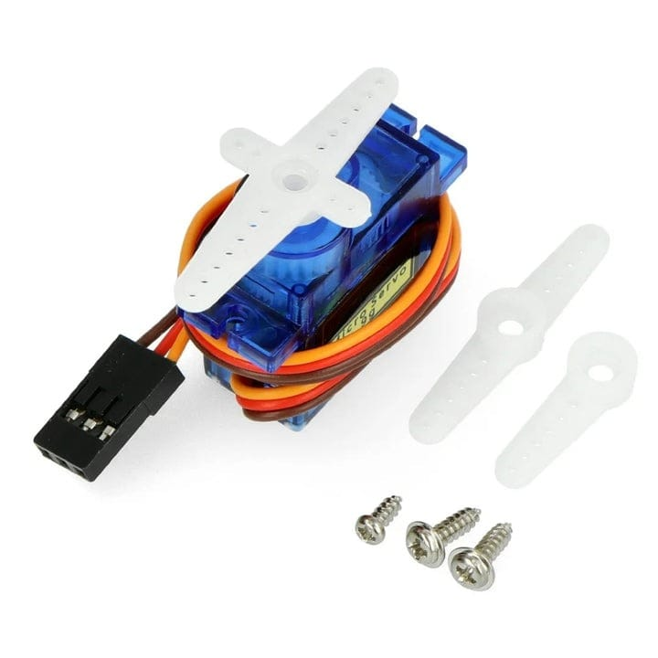
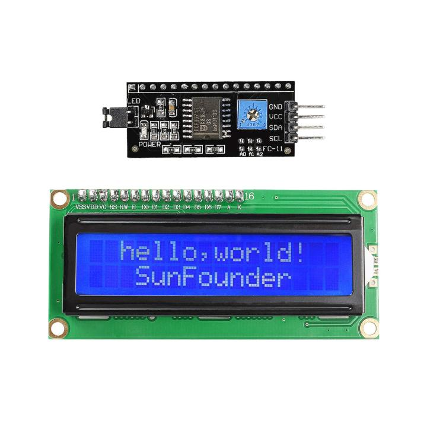
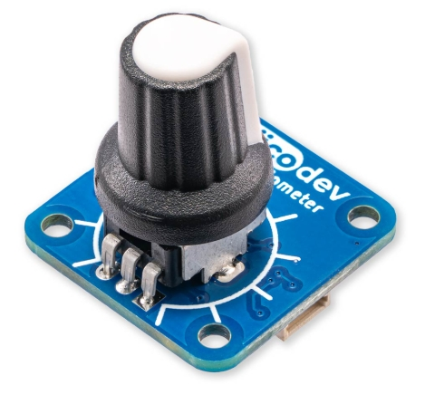
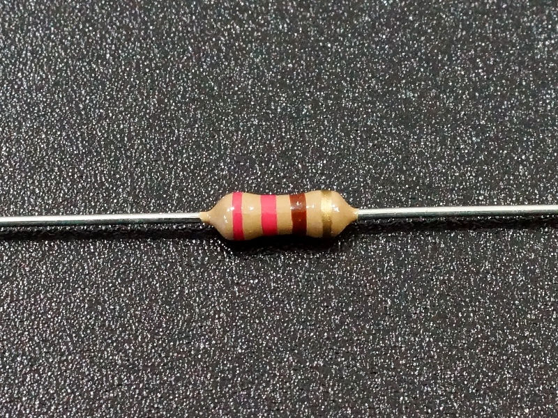
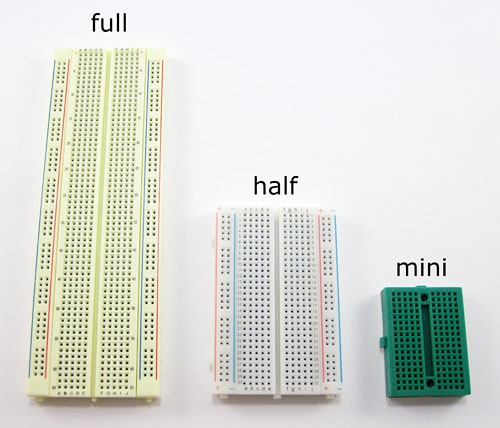
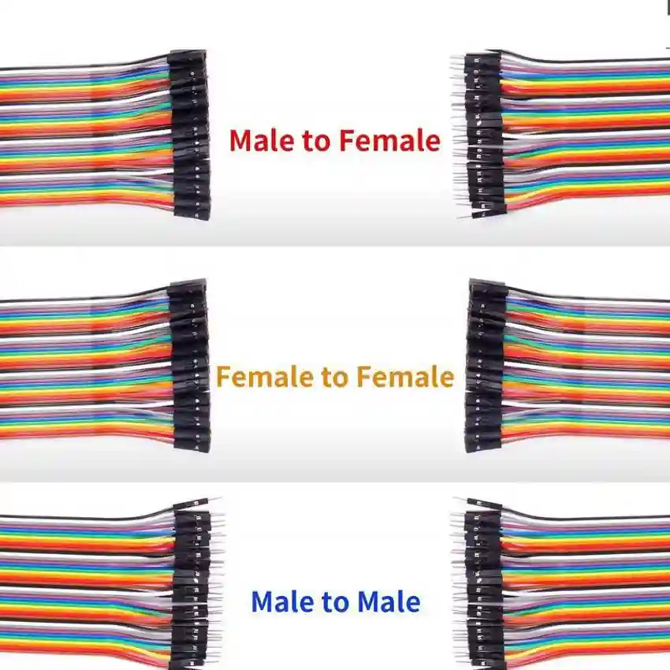
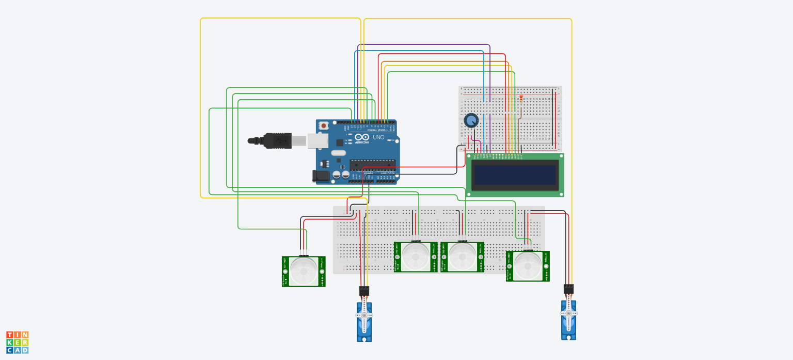

# 🚗 Smart Parking System using Arduino

This is a Smart Parking System built with **Arduino UNO**, **PIR motion sensors**, **Servo motors**, and a **16x2 LCD display**. The system uses two breadboards to neatly manage wiring and components. It monitors and updates the availability of parking slots, automates gate control, and displays real-time status on the LCD.

> 👨‍💻 Project by: [**Saptarshi Bose**](https://github.com/Sapfire007)

---

## 📌 Features

- ✅ **Real-time slot availability detection** via PIR sensors.  
- 🚪 **Automated gate control** using servo motors.  
- 📟 **LCD screen** shows up-to-date slot statuses.  
- 🔁 **Toggle logic** for slot availability based on motion detection.  
- 🔒 **Prevents gate opening** if all slots are occupied.

---

## 🧩 Components & Descriptions

### 🔷 Arduino UNO R3

</br>
A microcontroller board based on the ATmega328P. It controls sensors, servos, and the LCD.

---

### 🔷 PIR Motion Sensor

</br>
Detects movement. Used to:
- Toggle slot availability.
- Trigger gate openings.

---

### 🔷 Servo Motor (SG90)

</br>
Used to simulate gate movement. Rotates 90° to open, and 0° to close.

---

### 🔷 16x2 LCD Display

</br>
Displays parking slot availability. Controlled using the LiquidCrystal library.

---

### 🔷 Potentiometer

</br>
Used to control the **contrast** of the LCD display. Connected to pin V0 of the LCD.

---

### 🔷 220Ω Resistor

</br>
Connected in series with the **LCD backlight** (pin A/Anode) to limit current and prevent damage.

---

### 🔷 Breadboards (x2)

</br>
Used for wiring components:
- Breadboard 1: Sensors and servos  
- Breadboard 2: LCD and supporting components

---

### 🔷 Jumper Wires

</br>
For easy connections across components and Arduino.

---

## 🛠️ Hardware Summary

| Component           | Quantity |
|--------------------|----------|
| Arduino UNO        | 1        |
| PIR Motion Sensors | 4        |
| Servo Motors       | 2        |
| 16x2 LCD Display   | 1        |
| Potentiometer      | 1        |
| 220Ω Resistor      | 1        |
| Breadboards        | 2        |
| Jumper Wires       | As needed |
| Power Source       | 1 (Battery or USB) |

---

## 🔌 Pin Configuration

| Component                     | Arduino Pin     |
|------------------------------|-----------------|
| LCD (RS, E, D4–D7)           | 12, 11, 5, 4, 3, 2 |
| PIR for Slot 1 Availability  | 7               |
| PIR for Slot 2 Availability  | 8               |
| PIR to Open Gate for Slot 1  | 13              |
| PIR to Open Gate for Slot 2  | 6               |
| Servo Motor for Slot 1 Gate  | 9               |
| Servo Motor for Slot 2 Gate  | 10              |

---

## 🧠 How It Works

- **Slot Toggling Logic**:
  - PIR at pin 7 toggles Slot 1 availability.
  - PIR at pin 8 toggles Slot 2 availability.

- **Servo Gate Control**:
  - PIR at pin 13 opens Servo 1 gate.
  - PIR at pin 6 opens Servo 2 gate **only if at least one slot is available**.

- **LCD Display**:
  - Displays:
    ```
    Slot 1: A / NA
    Slot 2: A / NA
    ```

---

## 📷 Circuit Diagram (Simulation)



> 🧪 Simulated and tested using Tinkercad or a similar simulation platform.  
> 🔗 [View the Tinkercad Simulation](https://www.tinkercad.com/things/6G59puYOEhn-smart-parking-system-using-arduino)

---

## 🧪 Breadboard Usage

- **Breadboard 1**:
  - PIR sensors and servo motors.

- **Breadboard 2**:
  - LCD, potentiometer, 220Ω resistor, and control pins.

---

## 💡 Future Enhancements

- Add **buzzer/LED alerts** for full capacity.
- Integrate **Wi-Fi or Bluetooth** for app-based monitoring.
- Expand to more slots using **multiplexers** or **shift registers**.

---

## 📄 License

This project is open-source for educational and non-commercial use.

---

Made with ❤️ using Arduino and real-world problem-solving by [Saptarshi Bose](https://github.com/Sapfire007).